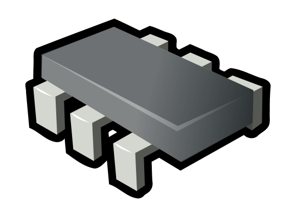

# Microcontroller HAL Reference Implementation

**Note:**  
This is a work in progress.  
The code has been written as a basis for the study of microcontrollers APIs, HALs and drivers. 
This work is based mainly on Jacob Beningo's book <i>Reusable Firmware Development</i>. Apress. 2017.

Author: Eng. Jonnes F. Nascimento. 2021
